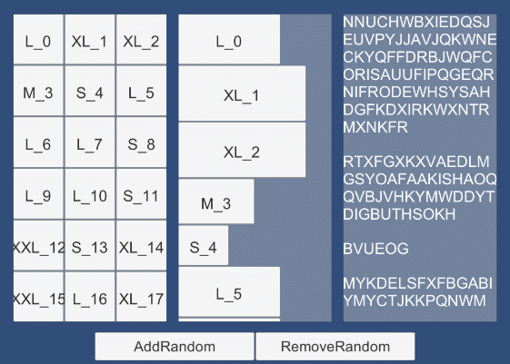
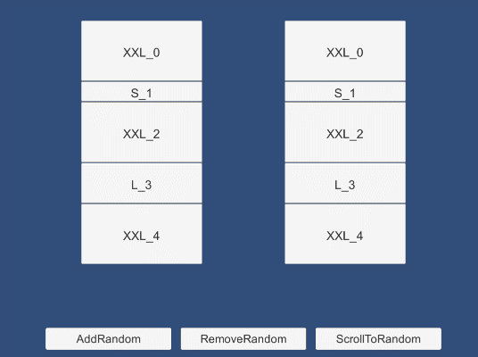
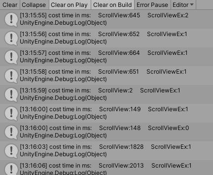

## ScrollView

基于UGUI的动态滚动列表，主要支持以下功能：

1. 继承自UGUI的`SrollRect`，支持`ScrollRect`的所有功能；

2. 使用对象池来管理列表元素，以实现列表元素的复用；

3. 支持一行多个元素或一列多个元素；

4. 可使用不同尺寸的列表元素；

5. 列表数据变化后动态刷新列表元素；

用法详见工程中附带的示例，场景`Scene`中的`Canvas1`及脚本`TestScript`。

## ScrollViewEx

当item数量巨大时，可以使用`ScrollViewEx`。

`ScrollViewEx`继承了`ScrollView`的所有功能，并进行了针对性的优化，它会对item进行分页，设置适当的页面尺寸可以得到更好的性能表现，详见场景`Scene`中的`Canvas2`，及脚本`TestLargeAmount.cs`。

以下是当有50000个item时使用`ScrollView`和`ScrollViewEx`，并指定页面尺寸30：

当随机地添加、删除数据或随机跳转时二者耗时：

---

## ScrollView

A DynamicScrollView component based on UGUI that has the following features:

1. Extented from `SrollRect`(UGUI class), so supports all the functions of `ScrollRect`;

2. Scroll items are managed by an object pool so they can be recycled and reused;

3. More than one items in one row (or column) is supported;

4. Items can have different sizes;

5. Items can be updated when scrollview data change;

For more details please run the test case: active `Canvas1` in `Scene` and play or read `TestScript`.

## ScrollViewEx

When there is a large number of items, `ScrollViewEx` is recommended.

`ScrollViewEx` inherits all the features of `ScrollView` and is optimized for handling massive items by pagination. An appropriate pageSize will result in better performance, see `Canvas2` in scene `Scene` and script `TestLargeAmount.cs` for details.

The following case shows that a `ScrollView` and a `ScrollViewEx` are both working with 50000 items and the latter has a pageSize of 30:

The time cost for random add/remove/scrollTo operation:

